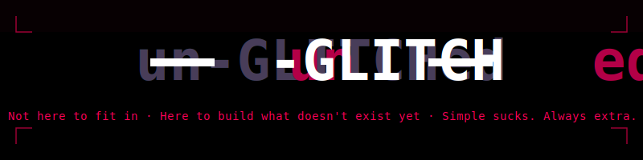
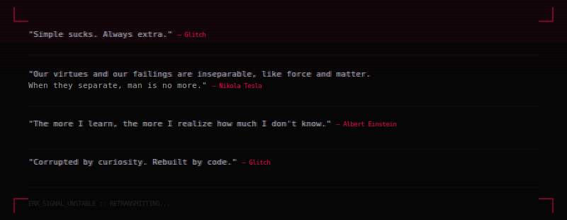

 
<h1></h1>
 
### `Not here to fit in · Here to build what doesn't exist yet · Simple sucks. Always extra.`
 
 ---
 

 

 

 
---
 

 

## WHO AM I

---

 

 
## CURRENT LOADOUT
 
| DOMAIN | STACK | STATUS |
|--------|-------|--------|
| AI & ML | Python · Scikit-learn · NumPy · Pandas | `learning` |
| Full-Stack | HTML · CSS · JS · React | `building` |
| Data Science | Data Analysis · Visualization · Stats | `exploring` |
| 3D & Design | Blender · Creative Tools | `creating` |
| Cybersecurity | Algorithms · Systems | `curious` |
 

 
---
 

 
## THE STACK
 

 

 

 
## STATS 
 

 

 

 

 
---
 

 
## WHAT I'M CURRENTLY BREAKING
 

 

 
---
 

 
## INSPIRATION

 
---
 
## FIND ME
 

 
---

 

